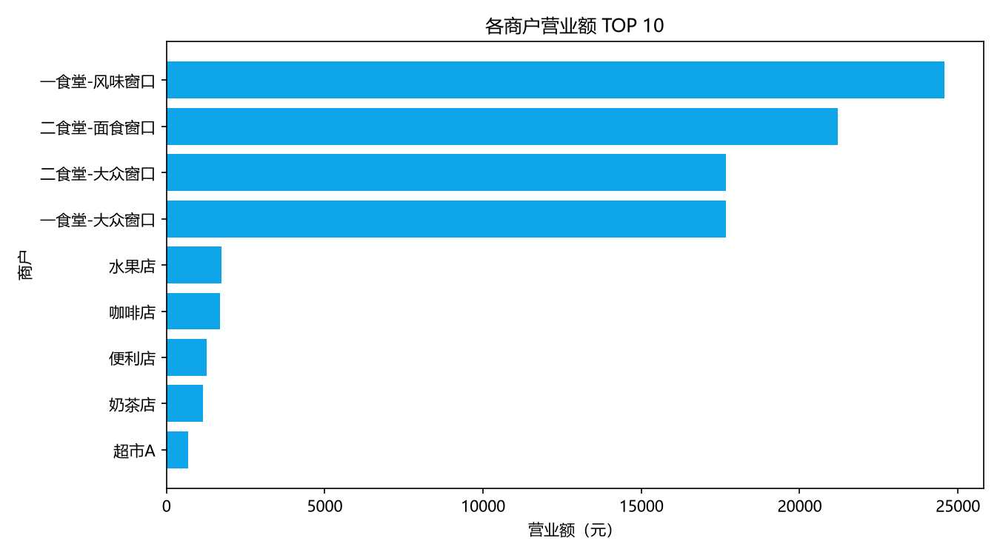

# AI 数据分析 Agent 演示记录

以下问答均为 `analysis/data_agent.py` 的真实运行输出
（模型：智谱 glm-4.6v，通过工具调用获取 pandas 计算结果）。

## Agent 是怎么工作的

```text
用户中文问题
    ↓
模型判断需要哪个工具（工具白名单，共 9 个）
    ↓
pandas 真实执行统计，返回数字
    ↓
模型基于工具结果组织回答（数字可追溯、可验证）
```

核心设计：

- 模型只能选择工具，不能执行任意代码
- 工具执行异常时把错误如实回传，不让模型乱编
- 最多循环 6 轮，防止 Agent 死循环
- 调用了某个工具后，回答末尾自动附上对应图表

## 示例 1：单工具调用

提问：

> 哪个商户营业额最高？请给我具体数字

工具轨迹：`get_merchant_revenue`

回答：

> 营业额最高的商户是**一食堂-风味窗口**，营业额为 **24,574.46 元**。

营业额前三名分别是：

1. 一食堂-风味窗口：24,574.46 元
2. 二食堂-面食窗口：21,212.27 元
3. 二食堂-大众窗口：17,670.35 元

自动附带图表：



## 示例 2：连续多轮工具调用

提问：

> 哪个小时消费笔数最多？哪个学院的人均日消费最低？顺便看看低消费候选学生有多少人

工具轨迹：

```text
第 1 轮：get_hourly_peak
第 2 轮：get_college_per_capita
第 3 轮：get_low_consumption_candidates
```

回答：

> - 消费笔数最多的时段是 18 点（1336 笔）
> - 人均日消费最低的学院是计算机学院（34.29 元）
> - 低消费候选学生共 12 人（日均 ≤ 32.01 元）
>
> 注：低消费名单为初步筛查结果，需人工复核确认。

## 示例 3：年级维度

提问：

> 2022 级和 2024 级学生的人均日消费分别是多少？哪个更高？

工具轨迹：`get_grade_per_capita`

回答：

> - 2024 级学生人均日消费：35.96 元
> - 2022 级学生人均日消费：35.03 元
>
> **2024 级学生人均日消费更高**，比 2022 级高出 0.93 元。

## 示例 4：学生个人画像

提问：

> 帮我看看学号 20230001 这名学生的消费画像

工具轨迹：`get_student_profile`

回答：

> 学号 20230001：3 周总消费 653.74 元，共 50 笔，有效消费 21 天，日均 31.13 元。
>
> 常去商户：一食堂-大众窗口（180 元）、一食堂-风味窗口（152 元）、二食堂-面食窗口（146 元）
>
> 高频时段：18 点（13 次）、7 点（8 次）、13 点（7 次）

## 示例 5：越界问题处理

提问：

> 预测一下我下个月的消费金额

回答（不调用任何工具，诚实说明边界）：

> 很抱歉，我目前没有预测未来消费金额的功能。我的工具主要用于分析历史消费数据，
> 如总营业额、各时段消费高峰、商户排名、品类占比、各学院人均消费等。

## 目前可用的 9 个工具

| 工具 | 用途 |
| --- | --- |
| `get_overview` | 数据总览：笔数、总营业额、人均日消费 |
| `get_hourly_peak` | 各小时消费笔数，回答高峰问题 |
| `get_merchant_revenue` | 商户营业额排名 |
| `get_category_revenue` | 食堂/超市/饮品品类占比 |
| `get_college_per_capita` | 学院人均日消费 |
| `get_grade_per_capita` | 年级人均日消费 |
| `get_gender_per_capita` | 性别人均日消费 |
| `get_student_profile` | 单个学生消费画像（需完整学号） |
| `get_low_consumption_candidates` | 低消费候选筛查 |

## 自己复现

```bash
pip install -r requirements-agent.txt
# 设置 ZHIPU_API_KEY 后：
python analysis/data_agent.py --question "哪个商户营业额最高？"
python analysis/data_agent.py --trace   # 交互模式并显示工具调用
```
