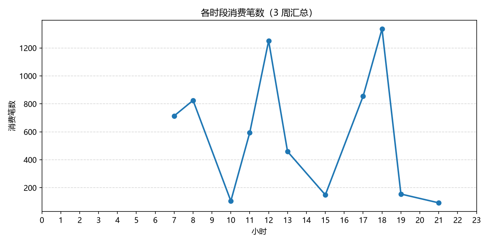
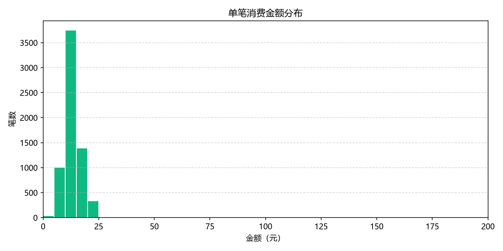
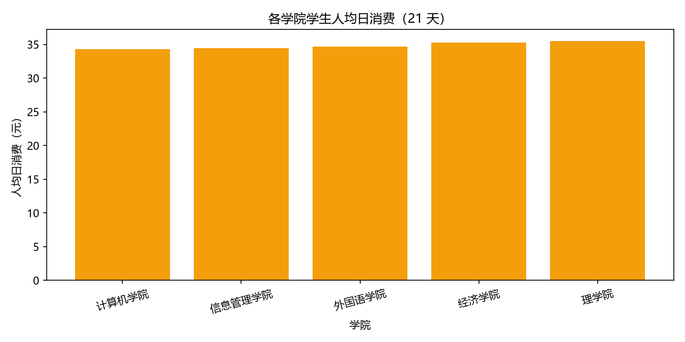

# 校园一卡通消费分析报告

> 数据范围：模拟 120 名学生在 2026-03-02 至 2026-03-22（21 天）的校园卡消费流水。
> 数据质量：原始 6593 条，清洗后 6535 条（清洗记录见 `cleaning_report.md`）。

## 一、执行摘要

本次分析基于校园一卡通消费数据，回答了消费时段、热门商户、消费水平与低消费识别四类问题。主要发现：

1. 消费集中在三餐时段：早餐 8 点、午餐 12 点、晚餐 18 点各有高峰，其中单小时笔数以晚餐 18 点最高。
2. 食堂消费占绝对主导（93% 的营业额），其中一食堂-风味窗口最受欢迎。
3. 平均单笔消费 13.42 元；按 120 名学生与 21 天折算，人均日消费约 34.8 元。
4. 初步筛出 12 名低消费候选学生，需结合其他信息人工核实。

## 二、问题 1：哪些时段是消费高峰？

结论：消费集中在三餐时段，早餐 8 点、午餐 12 点、晚餐 18 点各有一个高峰。按单小时笔数排序，前三位为：18 点（1336 笔）、12 点（1251 笔）、17 点（855 笔）。

建议：午餐 12 点和晚餐 18 点前后食堂压力最大，可考虑错峰宣传、增开窗口或优化排队动线。

## 三、问题 2：哪些商户和品类最受欢迎？

按品类统计营业额：

| 品类 | 营业额（元） | 占比 |
| --- | ---: | ---: |
| 食堂 | 81127.31 | 92.5% |
| 超市 | 3704.79 | 4.2% |
| 饮品 | 2852.00 | 3.3% |

结论：营业额最高的三家商户是一食堂-风味窗口（24574 元）、二食堂-面食窗口（21212 元）、二食堂-大众窗口（17670 元）。食堂是绝对主力，超市和饮品属于补充消费。

建议：采购与备货资源优先向高营业额食堂窗口倾斜；超市可结合销售结构优化小商品选品。

## 四、问题 3：学生人均消费大概是多少？

结论：平均单笔消费 13.42 元；金额集中在 10~18 元区间。整体人均日消费约 34.8 元，各学院差异不大。

## 五、问题 4：是否存在可能生活困难的低消费学生？

方法说明：只统计**经常刷卡**的学生（21 天中有效消费天数不低于中位数），再取其中平均每天消费最低的 10% 作为候选，避免把“不用校园卡”误判为“消费低”。

筛选结果：12 名学生进入低消费候选名单。（参考阈值：平均每日卡内消费 ≤ 32.01 元）

候选示例（学号已打码）：

| 学号 | 平均每天消费 | 有效天数 | 3 周总消费 |
| --- | ---: | ---: | ---: |
| 2024****30 | 27.97 元/天 | 21 天 | 587.42 元 |
| 2023****89 | 28.07 元/天 | 21 天 | 589.48 元 |
| 2025****43 | 29.26 元/天 | 21 天 | 614.51 元 |

**重要提醒：** 本名单只是基于校园卡流水的最初步筛查。低卡消费可能是因为在校外就餐、自己做饭等正常原因，不能据此给学生贴标签。真实场景中应结合辅导员走访、其他补贴记录等信息人工核实，并严格保护学生隐私。

## 六、运营建议汇总

1. **排班**：午餐 11:30-12:30 增加窗口和服务人手；早餐与晚餐按 8 点、18 点峰值安排备餐。
2. **备货**：食堂高销量窗口优先保证供应；超市、饮品按各自销售结构补货。
3. **帮扶**：对低消费候选学生建立人工复核流程，避免直接依据单一刷卡数据下结论。
4. **数据管理**：刷卡数据应定期做重复、缺失、异常检查，分析口径保持统一。

## 七、数据局限

- 本数据为模拟数据，结论只能演示分析方法，不代表真实校园情况。
- 一卡通只覆盖部分消费场景，无法反映校外消费。
- 金额分布存在模拟参数造成的规律性（如固定商户价格区间）。

---

附录：原始数据清洗过程见 [cleaning_report.md](cleaning_report.md)。
